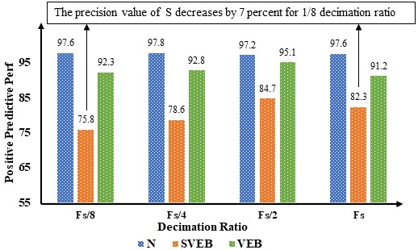
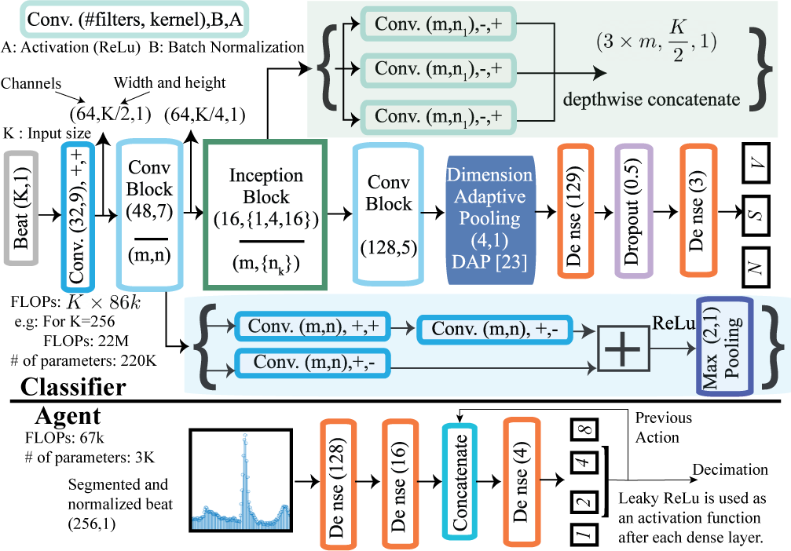

# AdaptiveSampling-DRL

## Initial Setup
## Running Scripts

## Motivational Example
#### The model architecture is implemented in [models.py](https://github.com/Berken-demirel/AdaptiveSampling-DRL/blob/main/dana_MIT_constant.py). Requirements_2 is needed to run the script without errors.

## Model Architecture
#### The model architecture is implemented in [models.py](https://github.com/Berken-demirel/AdaptiveSampling-DRL/blob/main/models.py). Requirements_2 is needed to run the script without errors.

## Utilities Script
#### [swd_utils.py](https://github.com/Berken-demirel/SWD_Detect/blob/master/Human/swd_utils.py) contains most of the important functions such as estimating the Multitaper PSD, configuration function provides Leave N One Out [Cross Validation](https://en.wikipedia.org/wiki/Cross-validation_(statistics)), metric calculation etc. All functions are explained inside the script just after the definition. Feel free to investigate further.

## Reading the MIT-BIH data
#### Since the data got from [MIT-BIH](https://physionet.org/content/mitdb/1.0.0/) is not segmented and normalized, some file handling functions are coded in [data_prep_MIT-BIH_beat.py](https://github.com/Berken-demirel/AdaptiveSampling-DRL/blob/main/data_prep_MIT-BIH_beat.py). Please note that [requirements_3](blabla) is necessary to run this script.

